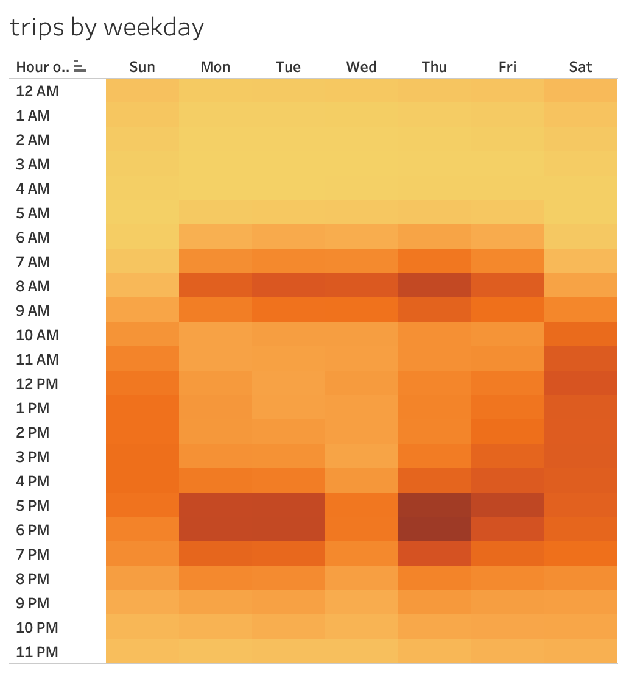
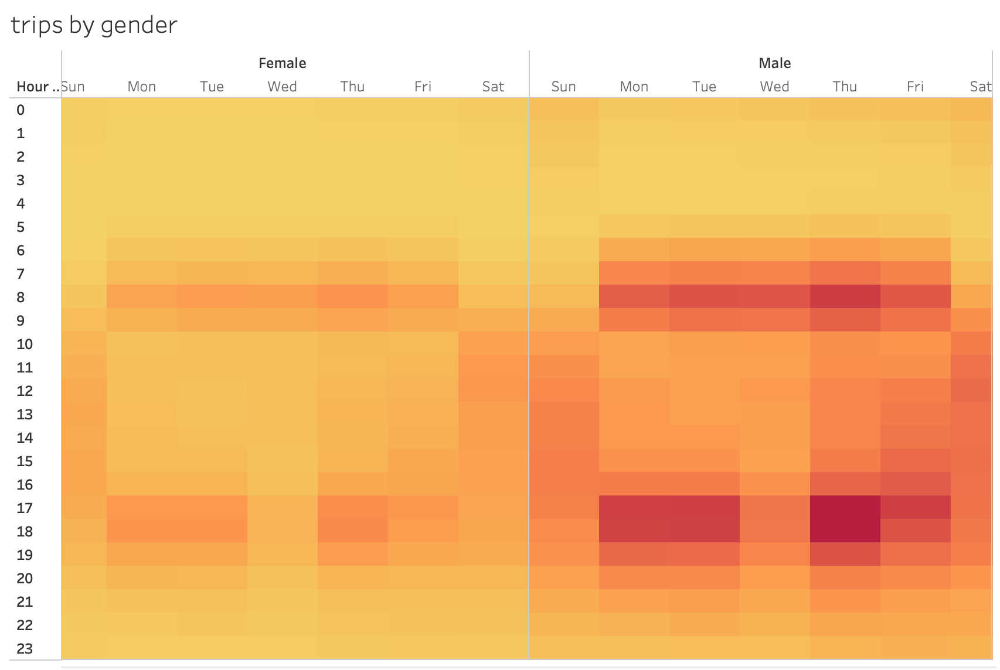
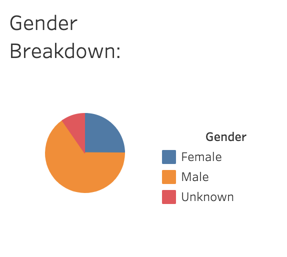
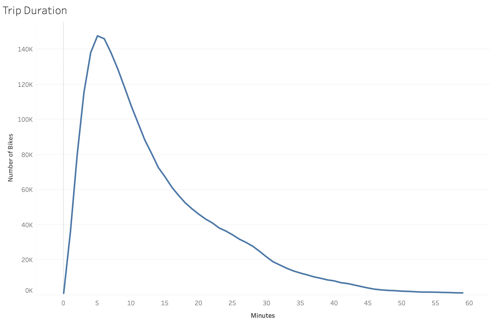
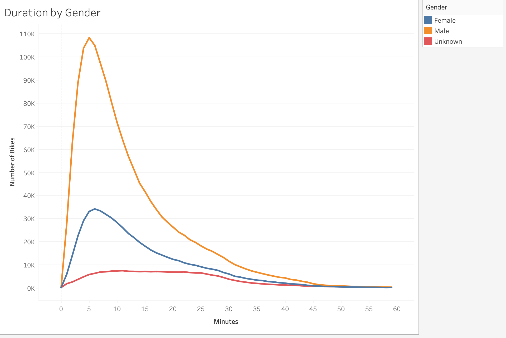
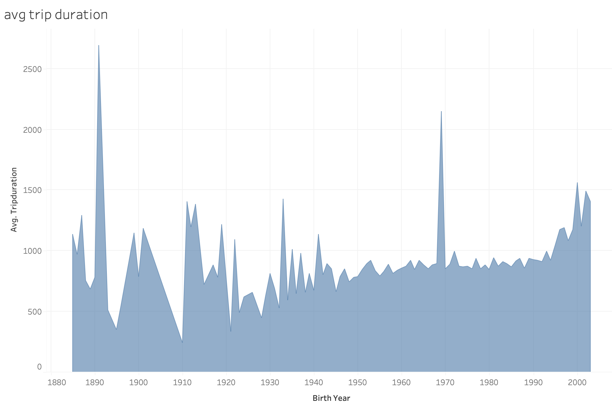

# bikesharing

## 1. Project Overview

Here, I used Tableau to visualize bicycle rideshare data from New York City. 
Specifically, I analyzed ridership data from August 2019 to identify patterns that could be relevant to establishing a new
rideshare program in Des Moines, Iowa. Part of this analysis required re-formatting the original Citibike data using Pandas
in Python. The code for that alteration is available in the file ```NYC_Citibike_Challenge.ipynb```.
Results of the analysis are visible in
[a Tableau Public story linked here](https://public.tableau.com/app/profile/benjamin.johnson4844/viz/14_NYCitiBikes/NYCBikes), 
with an additional summary provided below.

## 2. Results

- One clear trend is that ridership is highest during rush hours on weekdays (~7-9am, ~5-7pm), 
whereas weekend ridership appears heavy and evenly distributed across daytime hours. This is visible in 
the following heatmap of ride counts by hour:



- When broken down by gender, both male and female riders appear to follow this same hourly trend. Riders of unknown gender
don't show a clear hourly trend, though this may be due to a small sample size: 


- The hourly trends above appear clearest among male riders, however this is likely because males comprise ~2/3 of all riders:


- Most riders appear to be "subscribers" (repeat customers) as opposed to "customers" (one-time renters). This is clear for both
male and female riders, though riders of unknown gender appear not to subscribe as much:


- Short rides appear to be the preferred option for bike rentals. The most frequent trip duration is between ~5-10 minutes long,
and the vast majority of rides are less than 30 minutes:


- This tendency toward shorter trips is consistent across all genders:


- - Trip duration doesn't appear to vary substantially across age groups. Younger riders appear to, on average, take slightly longer
bike rides, however there's substantial noise in results across ages, making generalizations difficult here:


## 3. Summary

This Tableau story offers a general look into NYC bikeshare ridership. Generally, summertime ridership is high for short trips during weekends
and weekday rush hours, suggesting many people use bike rentals for both recreation and commuting. This general popularity is 
good news for anyone hoping to sart a new bikeshare program in other cities. 

As a more detailed follow-up, it would be useful to examine how much ridership varies from month to month 
(for example, how much does inclement winter weather decrease rental revenues?).
Additionally, it would be helpful to more closely examine ridership difference between weekdays and weekends: where are the most
popular starting/stopping locations for commuting vs recreation and how do trip durations differ between the two? Understanding these
distinctions will help better tailor where and how many bikes to provide for different types of activities within the city. 